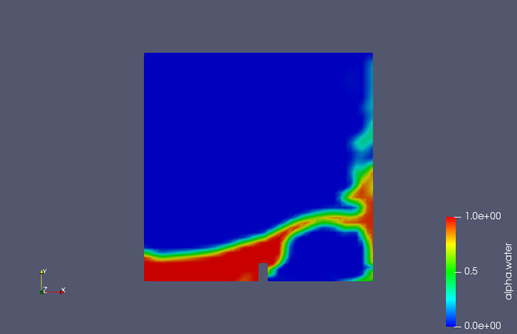

# OpenFoam-Open-Channel-Flow-Tutorial
This tutorial describes simulating open channel flow in OpenFoam with environmental application.

## Open channel flow
Open channel flow is a distinct category of fluid flow (Young et al., Granger)
where there is an interface between the water and atmosphere which
is not assumed constant and also called free surface flow.
This flow type includes many applications in environmental,
coastal, hydraulic and ecological engineering such as dams, weirs, spillways, fish passages, boat wakes and hydraulic structures. There is increased use of CFD
in environmental engineering (Liu and Zhang).
Fluent and other commercial packages are available but OpenFoam is 
free and is useful as the details and source can be modified by the user. 

1. Physics of open channel flow

Reynolds number is a dimensionless variable widely used in fluid mechanics which is defined as Re = rho UL/mu and can be interpreted as the ratio of inertia force over the viscous force. For large Re, turbulent flow. For small Re, we have laminar flow.
There is another dimensionless variable key to open channel flow. Key body force is gravity.
Since open channel flow there is a free surface between the water and the air (atmosphere), Froude number = U/sqrt(gL).

If Froude number
in application write Fr_1 for the incoming flow Froude number.
The critical Froude number.
For hydraulic jump a type of flow where ....

2. Open channel Tutorial cases

There are several open channel flow tutorial cases that come with OpenFoam including the
damBreak tutorial and
weirOverflow tutorial.

3. Setting up open channel flow cases ###
Certain additional parameter is needed in open channel flow.
First, because the interface between water and air is a free surface need to track this over time.
In these tutorials a new variable called alpha.water which denotes the.....
We have 
$ 0 \le alpha.water \le 1.0$.

### Mesh and boundary and initial conditions - Preprocessing
Mesh....blockMeshDict
when creating the mesh for the problem, we need to in blockMeshDict file have the top boundary (wall)
of domain be atmosphere.

Initial Conditions as with any variable to solve for in simulation, we need to set alpha.water as initial condtion in the domain. 
How to do this in openFoam

Boundary conditions
the patch atmosphere

constant directory
need to include g as a file, where the m/sec2... how is this used in the code?

### Solvers for open channel flow
The finite volume method is used in OpenFoam package to solve the governing PDE equations of Navier-Stokes.
To this we add a variable to solve as discussed above
interFoam solver (multiphase) 
volume of fluid (VOF) method

Details on interFoam solver can be found on openfoamwiki:
[interfoamwiki](http://openfoamwiki.net/index.php/InterFoam)

How to use the MULES multidimensional universal limiter notes included
in release notes for Openfoam 2.3.0 where they changed the structure a bit.
In our open channel cases the alpha.water need to make sure the variable bounded between zero and one?
[MULESreleasenotes](https://openfoam.org/release/2-3-0/multiphase/)

### 

### Open Channel Tutorial Cases
These cases are under multiphase directory in tutorial directory.

1. damBreak
   -laminar 
   -interFoam multiphase solver

alpha.water post the screenshot here.

2. weirOverflow
   -RAS 
   -turbulence model

### Environmental engineering applications using OpenFoam (Literature review)
There are several studies that compare OpenFoam and FLOW-3D commercial CFD software in applications.

### References

Granger, R.A., Fluid Mechanics, Dover, 1995.

Hemida, Hasssan, OpenFOAM tutorial: Free surface tutorial using interFoam and rasInterFoam, Chalmers University, April 2008.

Leakey, Shannon, Inlets, outlets and post-processing for modeling open-channel flow with the volume of fluid method, Chalmers University, Dec. 2019.

Liu, X. Ph.D., P.E., and Jie Zhang, Ph.D., American Society of Civil Engineers. eds.,Computational Fluid Dynamics: Applications in Water, Wastewater and Stormwater Treatment, 224pp, 2019.

OpenFOAM 2.3.0: Multiphase modeling, Predictor-corrector semi-implicit MULES, Feb. 17, 2014 blog at openfoam.org.

Young, D.Y., Munson, B. R., Okiishi, T.M. A brief introduction to fluid mechanics, 3rd edition, John Wiley and Sons, 2004.

