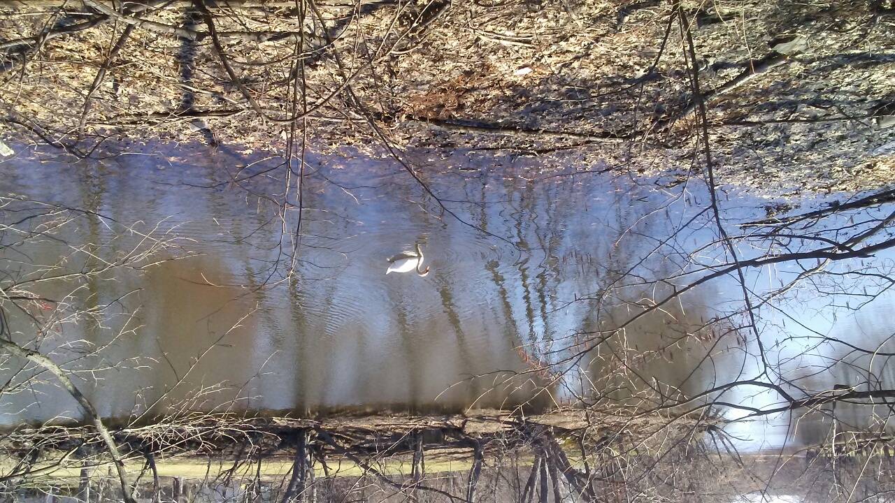
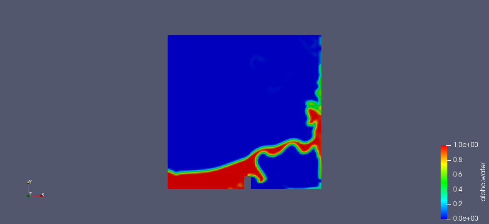
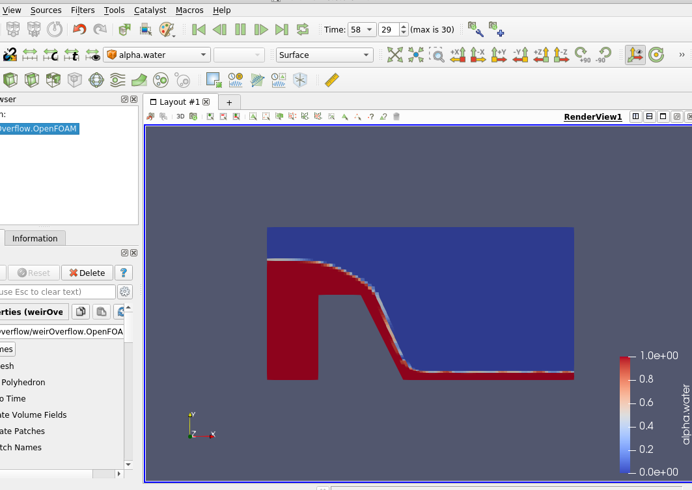

 Mystic River near Alewife Brook. 
# OpenFoam-Open-Channel-Flow-Tutorial 
This tutorial describes simulating open channel flow in OpenFoam open source CFD package with a focus on environmental applications.
It is important to keep in mind that CFD is one tool to study, design, or optimize environmental engineering applications.
There are also physical models and in situ measurements.

Advantages of CFD
   * cheap compared to physical models
   * sensitivity analysis is easy to perform
   
Disadvantages of CFD
   * uncertainties related to discretization, mesh, physical model
   * potential user error of software packages

OpenFoam can easily be run on multiprocessors on a laptop or desktop, making transient 3D turbulence
modeling widely available, either RANS or LES. As sensors become cheap and Internet of things data go online it will be useful to build
so-called digital twins of river, dam and stormwater systems. CFD models can help. Control of sensors and devices online are also becoming
a reality in real urban hydraulic systems.

## Open channel flow
Open channel flow is a distinct category of fluid flow (Young et al., Granger)
where there is an interface between the water and atmosphere.
The interface is not assumed constant and this type of flow is also called free surface flow. 
This flow type includes many applications in environmental,
coastal, hydraulic and ecological engineering such as dams, weirs, spillways, fish passages, and hydraulic structures. There is increased use of CFD
in environmental engineering (Liu and Zhang 2019).

Fluent and other commercial CFD packages are available but OpenFoam is 
free and is useful as the details and source can be modified by the user. 
There has been adoption of OpenFOAM for hydraulic applications at the German Federal Waterways Engineering
and Research Institute (Schulze and Thorenz 2014). 

1. Physics of Open Channel Flow

According to Young et al.:
> As for any flow geometry, open-channel flow may be _laminar_, _transitional_ or _turbulent_, depending on various conditions involved.
> Which type of flow occurs depends on the Reynolds number Re = rho V R_h/mu, where V is the average velocity of the fluid and R_h is the hydraulic
> radius of the channel...Since most open-channel flows involve water (which has a fairly small viscosity) and have relatively large characteristic
> lengths, it is uncommon to have laminar open-channel flows.

The hydraulic radius R_h is defined as R_h = A/P where A is the area of the cross-section and P is the wetted perimeter (the length of the perimeter of the of the cross section in contact with the fluid).

 * Gravity is a key element 

The Reynolds number is a dimensionless variable widely used in fluid mechanics which is defined as Re = rho UL/mu and can be interpreted as the ratio of  the inertia force over the viscous force. For large Re, we have turbulent flow. For small Re, we have laminar flow.
There is another dimensionless variable key to open channel flow where the key body force is gravity.
Since there is a free surface between the water and the air (atmosphere), the dimensionless Froude number = U/sqrt(gL), where U is velocity,
g is gravitational acceleration, and L is characteristic water depth, is important.
In application we write Fr_1 for the incoming flow Froude number.
The critical Froude number is important for hydraulic jump applications.

* Multiphase (two different fluids) modeling of air and water

The viscosity and density of air and water are different and are included in **transportProperties** file in the constant directory
in OpenFOAM. The surface tension of water is also included in this file.
The interface between the atmosphere and water surface needs to be tracked.
The additional equation to track the air/water interface is discussed below.

2. Open channel Tutorial cases - Sensitivity Analysis

There are several open channel flow tutorial cases that come with OpenFoam. These cases are in the multiphase directory.
We focus on the **damBreak** tutorial and
**weirOverflow**
tutorial. We shall perform sensitivity analysis changing mesh, solver and other parts of the cases.

3. Setting up open channel flow cases ###
Some additional information is needed in open channel flow.
Because the interface between water and air is a free surface, we need to track this over time.
A new variable (field) called alpha.water which denotes the phase fraction where alpha=1 is water and alpha=0 is air.
We have 
$ 0 \le alpha.water \le 1.0$. The water surface is then considered where alpha = 0.5.

### Preprocessing 
1. Mesh and boundary conditions

 When creating the mesh for the problem in the system/blockMeshDict file, the top boundary is type atmosphere and patch which comes with OpenFoam. 

2. Initial Conditions 

We need to set the alpha.water fields variable initial condition in the domain.
This is done with the **setFieldsDict** file in the system directory with alpha.water where the default value is
air so alpha.water is zero. After running blockMesh, we run **setFields** to set the alpha.water field variable.
The initial column of water in the damBreak tutorial is set as alpha.water is one for example.

The initial conditions for U and p_rgh variables set in the 0 directory have specific boundary conditions for the atmosphere, different
than the walls.
For example, for U, the walls have a no slip boundary condition but atmosphere has a pressureInletOutletVelocity boundary condition.

3. Constant 

We need to include g, gravitational acceleration, as a file in the constant directory.

### Multiphase Solvers for open channel flow
The finite volume method is used in the OpenFoam package to solve the governing PDE equations, i.e. Navier-Stokes.
We add a variable to solve, the phase fraction alpha.water in each cell.

There are several multiphase solvers included in OpenFoam.
The **interFoam** solver volume of fluid (VOF) method is an algebraic VOF formulation according to Leaky (2019). 
This method approximates the relative velocity, water minus the air velocity at each cell interface.
There is also the **interIsoFoam** VOF method which is regarded as a geometric VOF scheme. 
For both VOF methods, the MULES multidimensional limiter is used to bound the phase fraction (Cifani et al. 2016).
Specifics about the MULES multidimensional universal limiter notes is included
in release notes for Openfoam 2.3.0.
[MULESreleasenotes](https://openfoam.org/release/2-3-0/multiphase/)

Note that the assumption for the interFoam method is two immiscible fluids so that there is no exchange of mass and momentum.
The drawback is that certain phenomena such as bubbles and air entrainment that cannot be modeled with these methods which
may be required in application.
### 

### Open Channel Tutorial Cases
These cases are under the multiphase directory in tutorial director which comes with OpenFoam. These are incompressible
transient cases.

1. damBreak
This case uses:
   *laminar 
   *interFoam multiphase solver
   
In the damBreak case, since the column of water is initially at rest, the case is modeled in the laminar regime, since the Reynolds
number is zero initially and assumed low. Therefore no turbulence model is used.

alpha.water phase fraction (dimensionless) Time = 0.5 sec.

A drawback of VOF (volume of fluid method) is the delineation of the water surface which is needed for depth averaged or other output variables of interest in certain hydraulic engineering applications.
The free surface can be considered the level set of alpha=0.5.  

# Mesh Refinement
One test is to increase the mesh (mesh refinement).

We modify the blockMeshDict file to double the cells of the hex elements. We also check the mesh to make sure it is legal and we didn't make a mistake
in modifying blockMeshDict file.

Run the following commands.

1. blockMesh
2. checkMesh
3. setFields
4. interFoam

A screenshot here. alpha.water (interpolated) Time = 0.5 sec.

The mesh refinement simulation took 761 seconds with dt=0.001 sec. The time discretization method is Euler, which according to the OpenFoam
documentation is implicit, first order accurate, and transient.

# Backward Time Scheme not allowed in two phase models

Let us change the time discretization to dt=0.01 sec. 
We use the backward time scheme which is implict, second order accurate, conditionally stable but not guaranteed boundedness.
We modify the controlDict file to change the time step to dt=.01 sec and modify the fvSchemes file for ddtSchemes to backward.
If we run interFoam with these specifications, we get an error message "only Euler and CrankNicolson schemes are supported,"
with some section of the code involving two phase models. This makes sense because backward time schemes are not guaranteed bounded.

Instead we will try the CrankNicolson time scheme with dt=0.01 sec.
# Crank Nicolson time scheme 

2. weirOverflow
  This tutorial uses a turbulence model, kEpsilon (k-e) two equation model.
   * RAS 
   * turbulence model
   * k-\epsilon model   
      For C coefficients, the RASModels::kEpsilon uses for the default values Lander and (1974). 
      In this model,
      νt=Cμk^2/ϵ 
where
        νt	=	Turbulent viscosity [ m2s−1]
        Cμ 	=	Model coefficient for the turbulent viscosity [-]

   

### Environmental engineering applications using OpenFoam or other CFD package (Literature review)
OpenFoam studies or studies comparing OpenFOAM and commercial CFD software in environmental and hydraulic engineering have recently increased
in the literature.
Flow-3D is a commercial package focused on the free surface interface. 
ANSYS Fluent commercial package has also been used. This is an illustrative literature review, not mean to be exhaustive.

#OpenFoam studies

1. Model development in OpenFOAM to predict spillway jet regimes, J. Applied Water Engineering and Research (2015), Y. Yang, M. Politano, R. Laughery and L. Weber.

OpenFOAM using LES and detached eddy simulation was used to compare reduced scale model results. Total dissolved gas (TDG) can result in gas bubble disease in affected fish. Predicting spillway jet regimes is required.
    Preprocessing: Mesh: Gridgen V15 used to create grids.
    Solver: interFoam  (VOF)
    Turbulence closure: LES with detached eddy simulation
    
# Flow-3D studies    
Chanel, P.G. and J. Doering, Assessment of spillway modeling using computational fluid dynamics, Canadian Journal of Civil engineering 35(12), 2008.
The Flow-3D package is used to simulate discharge and simulations are compared to physical models.

# ANSYS Fluent studies
General Methodology for developing a CFD model for studying spillway hydraulics using ANSYS Fluent, R. Arunkumar and S.P. Simmovic, Report no. 098,oct 2017.

# Comparing OpenFOAM with FLOW-3D
1. OpenFOAM vs. FLOW-3D: A comparative study of vertical slot fishway modeling, Ecological Engineering (174) 2022, J.F. Fuentes-Perez, A.L. Quaresma, A. Pinheiro, F. J. Sanz-Ronda.
  Solver: interFoam (VOF)
  turbulence closure: LES
  
  
2. Characterization of structural properties in high Reynolds hydraulic jump based on CFD and physical modeling approaches, J. Hydraulic Engineering (146) 12, 2020, J. F. Macian-Perez, A. Bayon, R. Garcia-Bartual, P. Amparo Lopez-Jimenez, F.J. Valles-Moran.
3. 
  A classic hydraulic jump (Froude number 1 = 6) and Reynolds number 1 of 210,000 is simulated with both OpenFOAM and FLOW-3D and compared to experimental data designed for this purpose. THe conclusion is that both CFD codes represent the hydraulic jump variables accurately. There is difference in velocity distributiona nd pressure fluctuation differences but in general

### References
Bayon-Barrachina and P.A. Lopez-Jimenez, Numerical analysis of hydraulic jumps using OpenFOAM, J. Hydroinformatics 17(4), 662-278, 2015.

Cifani, P., Michalek, W.R., Priems, G.J.M., Kuerten, J.G.M., van der Geld, C.W.M. and Geurts, B.J, A comparison between the surface compression method and an interface reconstruction method for the VOF approach, Computers and Fluids, 136, 421-435, 2016.

Granger, R.A., Fluid Mechanics, Dover, 1995.

Hemida, Hasssan, OpenFOAM tutorial: Free surface tutorial using interFoam and rasInterFoam, Chalmers University, April 2008.
http://www.tfd.chalmers.se/~hani/kurser/OS_CFD_2007/HassanHemida/Hassan_Hemida_VOF.pdf

Launder, B.E. and D.B. Spalding. The numerical computation of turbulent flows, Computer methods in applied mechanics and engineering, 3(2):269–289, 1974.

Leakey, Shannon, Inlets, outlets and post-processing for modeling open-channel flow with the volume of fluid method, Tutorial documentation, Chalmers University, Dec. 2019.
http://www.tfd.chalmers.se/~hani/kurser/OS_CFD_2019/Shannon_Leakey/sleakey_report.pdf

Liu, X. Ph.D., P.E., and Jie Zhang, Ph.D., American Society of Civil Engineers. eds., Computational Fluid Dynamics: Applications in Water, Wastewater and Stormwater Treatment, 224pp, 2019.

OpenFOAM 2.3.0: Multiphase modeling, Predictor-corrector semi-implicit MULES, Feb. 17, 2014 blog at openfoam.org.
https://openfoam.org/release/2-3-0/multiphase/

Schulze, Lydia; Thorenz, Carsten (2014): The multiphase capabilities of the CFD toolbox for hydraulic applications. In: Lehfeldt, Rainer, Koppman, Rebekka (Hg.): ICHE 2014 Proc. of the 11th Conf. on hydroscience and engineering. Karlsruhe: Bundesanstalt fur Wasserbau. S. 1007-1016. https://henry.baw.de/bitstream/20.500.11970/99530/1/14_06.pdf

Young, D.Y., Munson, B. R., Okiishi, T.M. A brief introduction to fluid mechanics, 3rd edition, John Wiley and Sons, 2004.

